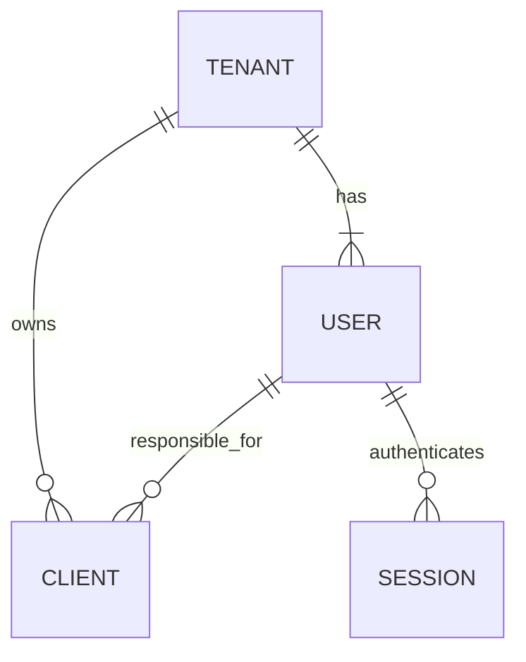

# Business and desktop design

## Implemented foundation

One business is one tenant. The sole super admin is outside all tenants. Each admin/trader belongs to exactly one tenant. Clients are separate from login users and carry both `tenant_id` and `user_id` (responsible user, defaulting to the creator). Tenant staff share clients; admins can reassign them within that business. A composite foreign key prevents cross-tenant assignment, even through direct SQL.

Users and clients are deactivated/archived instead of deleted, preserving references for future invoices and financial history. IDs and tenant membership cannot be changed through update payloads. Tenant paths are checked against the authenticated account; supplying another tenant ID does not grant access. A generated unique super-admin slot permits at most one super admin in the database. The bootstrap command establishes that account; no API can create, demote, or delete it.

## Next domain models (proposal, not implemented yet)

| Model | Proposed fields and meaning |
| --- | --- |
| Product | `id`, `tenant_id`, `title`, `code`, `quantity`, `pieces_per_unit`, `active`. Code unique within tenant. `pieces_per_unit` is a positive integer, e.g. 12 pieces per box. |
| Invoice | `id`, `tenant_id`, `client_id`, `created_by_user_id`, tenant invoice number, issue date, status, currency and totals. Invoice belongs to a client, not a login user. |
| Invoice item | Invoice/product references plus snapshots of title, code, pieces per unit, sold quantity, unit price, discount and line total. Later product edits must not change historical invoices. |
| Stock movement | Tenant/product references, signed quantity, movement reason and source invoice. Posting an invoice and reducing stock must be one transaction. |
| Client ledger entry | Tenant/client references, signed amount in integer minor currency units, type, source invoice/payment and timestamp. Append entries; corrections use reversals. |

Confirm whether `quantity` means boxes/units or individual pieces before implementing stock arithmetic. Recommended internal stock measurement: total individual pieces, with `pieces_per_unit` used to display boxes plus loose pieces. For example, 29 pieces with 12 per box displays as 2 boxes and 5 pieces. Unit price is separate from pieces per unit and is needed for invoices.

Use a single configured currency per tenant initially, integer minor units for money (not floating point), and explicit rounding rules. Establish tax, discounts, returns, invoice numbering and opening-balance rules before implementing financial posting.

For each client, define a positive ledger balance as money the client owes the business; a negative balance means the business owes the client. Future dashboard totals:

- Receivables: sum of positive client balances.
- Payables: absolute sum of negative client balances.
- Net money outstanding: receivables minus payables.

These are outstanding balances, not profit, cash on hand or inventory value. Show all three so debts and credits do not disappear into a single net number. No balance field is editable directly on the current client API.

## Desktop application

The Flutter application remains a Windows/macOS/Linux desktop client. Proposed layout: persistent sidebar, searchable tables, keyboard-friendly invoice entry, client statement view, and printable/PDF invoices. Tenant admins see their business; super admin gets a business/user administration workspace. Inventory, Clients, Invoices, Payments and Dashboard become separate sections as their APIs are added. No mobile screens or offline synchronization are included in this increment.
