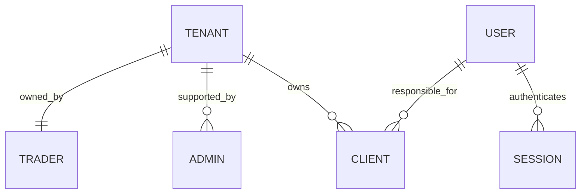

# Business and desktop design

## Implemented foundation

Each trader owns a separate tenant. The sole super admin is outside all tenants. Supporting admins belong to one trader's tenant. Two traders never share a tenant. Clients are separate from login users and carry both `tenant_id` and `user_id` (responsible user, defaulting to the creator). A trader and their supporting admins can manage/reassign clients within that trader's tenant. A composite foreign key prevents cross-tenant assignment, even through direct SQL.

Users and clients are deactivated/archived instead of deleted, preserving references for future invoices and financial history. IDs and tenant membership cannot be changed through update payloads. Tenant paths are checked against the authenticated account; supplying another tenant ID does not grant access. A generated unique super-admin slot permits at most one super admin in the database. The bootstrap command establishes that account; no API can create, demote, or delete it.

## Products, invoices and balances

Implemented models: products, invoices, invoice items, stock movements and client ledger. See [commerce-api.md](commerce-api.md) for exact contracts and limits.

Confirmed units: product and invoice quantities count whole boxes/packs. `pieces_per_unit` describes the number of pieces inside a pack. Prices are EGP per pack, stored in integer piastres. For example, 3 packs at EGP 29.50 per pack total EGP 88.50, independent of how many pieces are inside each pack.

Invoices are editable drafts until posted. Posting atomically assigns a tenant-local invoice number, deducts packs, records stock movements and debits the client ledger. Posted snapshots retain titles, codes, pack sizes, prices and client details. Voiding a posted invoice atomically restores stock and reverses debt. Cancelled drafts and void invoices stay in history. Stock changes and product/draft edits use version checks.

The dashboard separately shows client debts, amounts owed to clients and net outstanding. It currently includes posted invoice debits and void reversals only. Payment collection, payouts, opening balances, taxes, discounts, partial returns and PDF/printing are not implemented yet. These are outstanding balances, not profit or cash on hand.
## Desktop application

The Flutter application remains a Windows/macOS/Linux desktop client. Implemented layout: persistent sidebar, searchable product/client lists, invoice entry and review, and ledger overview. Client statements and printable/PDF invoices remain future work. Tenant admins see their business; super admin gets a business/user administration workspace. Inventory, Clients, Invoices, Payments and Dashboard become separate sections as their APIs are added. No mobile screens or offline synchronization are included in this increment.

Trader registration uses `POST /api/v1/tenants` with a `trader` object. Existing-tenant user creation only adds admin accounts. The MySQL unique trader slot rejects a second trader in the same tenant. API rules preserve the trader owner and disallow trader/admin role conversion. Suspend the entire tenant to suspend its trader and supporting accounts together. Supporting admins are operational users; the trader owner and super admin manage their accounts.